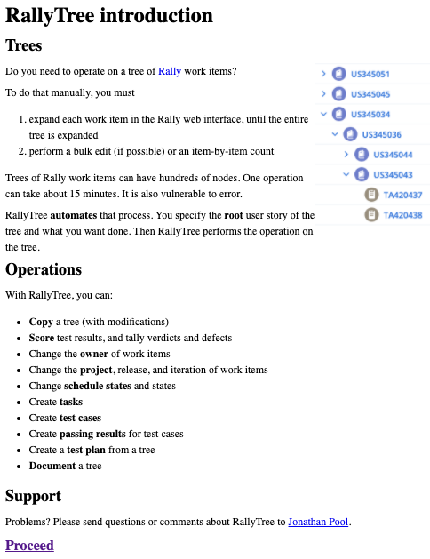
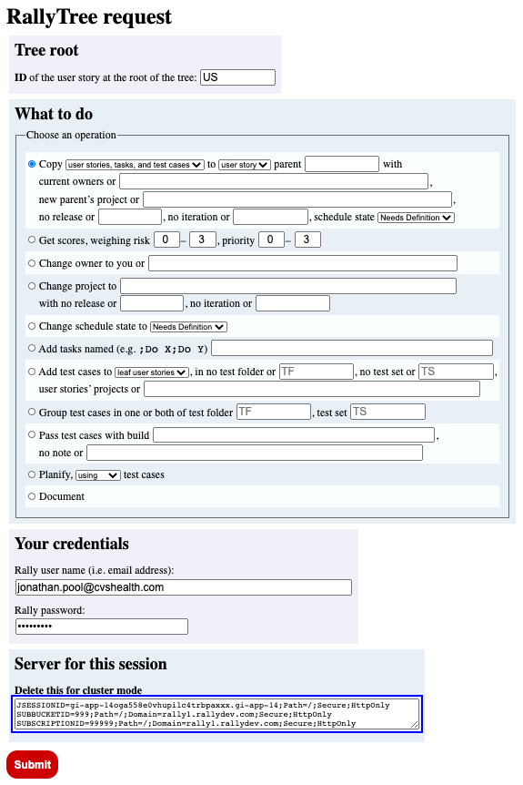

# rallytree

Automation of Rally work-item tree management.

# Introduction

RallyTree automates some operations on trees of work items in [Rally](https://www.broadcom.com/products/software/agile-development/rally-software). 

# Features

RallyTree can perform these operations on a tree:

## Tree-copy creation

This feature copies a tree. You designate an existing user story as the parent of the root user story of the new tree. That parent must not have any tasks and must not be in the tree that you are copying. Only user stories, optionally with their tasks and/or test cases, are copied, but not defects. In a copy of a user story, task, or test case, the name, owner, rank, and description are copied from the original, but the project affiliation is copied from the designated parent of the root of the tree copy.

## Scoring

This feature tallies the passing and failing results of the last runs of all the test cases, and the counts of defects, major defects, and minor defects, in a tree. It also reports a score, based on the risks and priorities of the passed and failed test cases. You can determine how the risks and priorities are weighed in the score.

## Owner change

This feature ensures that each user story, task, and test case in a tree has the desired owner. You can choose whether to become the new owner or instead to specify another user as the new owner.

## Project change

This feature ensures that each user story in a tree belongs to the desired project. Changing the project of a user story also makes its tasks and test cases belong to the same project. In case a user story already belongs to the desired project, but it has any tasks or test cases belonging to no or other projects, their project affiliations will not be changed. If you have a tree in this situation, you can change its project twice, with the second change specifying the project you really want. That will guarantee that all its user stories, tasks, and test cases belong to the desired project.

## Scheduling

This feature assigns a release, an iteration, and optionally a schedule state to each schedulable user story in a tree. A user story is schedulable if it has no child user stories.

## Task creation

This feature adds tasks to each user story with no child user stories in a tree. You can choose how many tasks to add to each user story and give a name to each task.

## Test-case creation

This feature adds test cases to a tree’s user stories that have no child user stories. Generally, each such user story acquires one test case, to which it gives its name, description, and owner. However, the counts and names of test cases can be customized. You can also specify a test folder and/or a test set that the test cases will all belong to.

## Pass creation

This feature creates passing results for all test cases of user stories in a tree, except for test cases that already have results or that have no owner. If a test case is in any test sets, the result is defined as belonging to the first of those test sets. You must specify a build (asRally requires) and may specify a note, to be applied to all of the new results. Whoever is the owner of the test case is defined as the tester of the result.

## Documentation

This feature produces a JSON representation of a tree of user stories.

# Customization

## Test cases

To customize the test cases that are created by the test-case creation operation, maintain a file named `caseData.js` in a top-level directory named `data` in your local repository. In that file, define a variable named `caseData` as follows:

```javascript
exports.caseData = {
  'User story name 0': [
    'Test case name 0',
    'Test case name 1',
    'Test case name 2'
  ],
  'User story name 1':[
    'Test case name 1'
  ]
};
```

The `caseData` object can have any user-story names as property keys. For each such key, you may specify 0 or more test-case names. If any user story has a name identical to the specified user-story name and is eligible for test-case creation (i.e. has no child user stories), RallyTree will create test cases with the specified test-case names (if any) for that user story. For any eligible user story whose name is **not** in `caseData`, RallyTree will create 1 test case, and it will have the same name as the user story.

# Architecture

## Platform

RallyTree is a `node.js` application that can be installed locally. It creates a web server running on `localhost:3000`.

The core functionality of RallyTree is performed by the functions `copyTree()`, `verdictTree()`, `takeTree()`, `projectTree()`, `scheduleTree()`, `taskTree()`, `caseTree()`, `passTree()`, and `docTree()` in the `index.js` file. These functions recursively perform operations on a specified user story and its applicable descendants.

## Server-client interactions

RallyTree interacts with its users, in part, as an ordinary web server. As such, it serves three pages:

- an introduction

    

- a request form

    

- a report

    

The interaction in the report page employs streaming. The report page, when served, initially displays counts of 0. But, as soon as it finishes loading, it automatically submits a request to the server. To fulfill the request, the server:

- creates a server-sent-event stream
- performs the form’s requested operation on the specified tree of user stories
- while processing work items, keeps sending new events to the browser

If an error occurs, including an error arising from the request form being improperly completed, the server emits an error event, causing an error message to be displayed on the report page.

Each (non-error) event identifies one of the count fields in the report and a new count. When the event arrives, the browser updates the report by repopulating that field with the new count. The user experience is to see the report page updating itself with increasing counts. Eventually the updating stops. That tells the user that the operation is complete.

As an exception, the tree-documentation report contains a tree representation. For each user story, it shows the name; counts of tasks, test cases, and child user stories; and an array of the child user stories of the user story. The task and test-case counts are cumulative. Thus, for a user story with child user stories, its task and test-case counts are the counts of tasks and test cases of all its descendant user stories. (If these counts were not cumulative, they would always be 0, because user stories with child user stories never have tasks or test cases.)

The server never sends an “operation complete” message to the browser. Arguably, relying on the user to detect completion by waiting long enough for further updates is a fragile solution, and the architecture should be revised to determine definitively when an operation is complete and inform the user of this fact.

## Server-service interactions

RallyTree interacts not only with users, but also with Rally.

Its interactions with Rally take place by means of [Rally’s web-services API](https://rally1.rallydev.com/slm/doc/webservice/).

At present these interactions are mediated by Rally’s Node integration package, [`rally-node`](https://github.com/RallyTools/rally-node). It simplifies the task of making requests to Rally and receiving the responses.

However, freeing RallyTree from dependence on `rally-node` may be beneficial, because:

- Implementing a single-host adaptation, described below, might improve RallyTree’s speed, but monitoring this adaptation to verify that it is working properly requires reading response headers, which rally-node does not permit.
- The rally-node package depends on the `request` library. But that library [went into “maintenance mode” in early 2019](https://github.com/request/request/issues/3142). Its developers [recommend using other, better libraries](https://github.com/request/request/issues/3143). This suggests that rally-node is not being energetically updated, and dependence on it could pose reliability, security, or other problems for RallyTree.

# Asynchronicity

## Design

The Rally operations are asynchronous, so operations on sets of work items can, in principle, occur in parallel. For example, if a user story has 6 child user stories, an operation can be requested on each of the 6 children, and Rally can perform those 6 operations in parallel.

When operations are performed in parallel, the order of the operations is not forecastable, and it cannot be foreknown which operation will be the last one. Therefore, RallyTree is **not** designed to

1. process a request,
1. then serve the report page after it is fulfilled.

Instead, RallyTree is designed (for most operations) to

1. immediately serve the report page,
1. let the report page request an operation on a tree,
1. perform the operation,
1. and incrementally send new events to the report page as they occur.

The report page displays the totals and updates them as new totals arrive. When the user sees that the total(s) are no longer being updated, the user knows that the process is finished. The wait time between updates depends on the time that Rally needs to process dependencies and synchronize its application servers. This time can reach almost 20 seconds per update in the project-change operation.

The documentation operation differs from the others in this respect. Its output can be voluminous. Updating it on every increment would annoy users and slow the result. Therefore, this operation outputs a result only if no subsequent result emerges within 1.5 seconds. Under normal conditions, there is only one (final) output from the documentation operation.

## Limitations

Asynchronicity in RallyTree has limitations. Some theoretically independent operations are not in fact independent. Errors can be thrown, for example, when:

- A child user story is updated while its parent user story is being updated.
- A test case is linked to a user story while another test case is being created.
- A user story is linked to a parent while another user story is linked to the same parent.

These are **concurrency conflicts**. The errors that they throw are sometimes misleading, such as

```
Not authorized to perform action: Invalid key
```

In other cases they correctly point to asynchronicity problems, such as

```
Error copying user story: Concurrency conflict:
[Object has been modified since being read for update in this context]
```

[According to Broadcom](https://community.broadcom.com/enterprisesoftware/communities/community-home/digestviewer/viewthread?GroupId=2437&MessageKey=a41c7c1b-f37b-4eb3-9647-b8d518341f86&CommunityKey=f303f769-8d4c-44d9-924c-3845bba6444e&tab=digestviewer&ReturnUrl=%2Fenterprisesoftware%2Fcommunities%2Fcommunity-home%2Fdigestviewer%3FCommunityKey%3Df303f769-8d4c-44d9-924c-3845bba6444e), truly **independent** requests can be made at any frequency without causing errors, because they are queued if they arrive faster than the 24-requests-at-once limit.

But [Broadcom acknowledges](https://knowledge.broadcom.com/external/article?articleId=77114) that **interdependent** requests will throw concurrency-conflict errors if they are made too rapidly in succession.

While Broadcom has not quantified “too rapidly”, Broadcom support engineer Dave LeDeaux informed us on 28 January 2020, “right now, it can take up to 8 seconds before our read-only databases are in sync to the read-write database due to some additional software we have in place to support the database migration we are undergoing. So the concurrency problem is likely especially bad right now.”

## Adaptations

### Introduction

In the above-cited knowledge-base article, Broadcom also suggests adaptations to prevent concurrency conflicts:

- inserting pauses between requests
- trapping errors and retrying operations until they succeed
- restricting all requests to a single host in its server cluster

### Previous solutions

RallyTree previously implemented error-trapping and pause-insertion adaptations suggested by Broadcom. These adaptations were deployed in retry and pause branches. The results of both adaptations were unsatisfactory. Even with 30 retries or with pauses of 1 second after every request, concurrency conflicts continued to arise.

### Current solutions

#### Single-host adaptation

RallyTree currently implements, as an option, the single-host adaptation suggested by Broadcom. The implementation sends a request to Rally to obtain a cookie and then sends back to Rally, with each request in the selected operation, three attributes (`JSESSIONID`, `SUBBUCKET`, and `SUBSCRIPTION`) from that cookie. Those cookie attributes ask Rally to use, for handling those requests, the same server it used for the original request, instead of arbitrarily choosing a server from the Rally cluster.

This adaptation is employed by default. To turn it off, you can clear the value of the first input field in the request form. That prepopulated value is the three cookie attributes.

Preliminary testing indicates that operations perform about 15% faster, on average, when the single-host adaptation is on than when it is off. To determine whether this adaptation improves performance for you, you can look at the console in the browser developer tools. There, the elapsed time of each operation is displayed.


The single-host adaptation does not prevent concurrency conflicts, contrary to what one might infer from the Broadcom documentation.

#### Sequentiality

RallyTree also implements a sequentiality adaptation. This is not one of those suggested by Broadcom. It consists of returning JavaScript Promises from each request and postponing the next request until the current Promise has been resolved.

For example, suppose a user story has six child user stories. Without this adaptation, RallyTree could process all six children in a batch. JavaScript would start working on them quasi-simultaneously, in no predictable order. Each child’s update could entail a change to the parent. To avoid a concurrency conflict, Rally would need to prevent any change to the parent between the time it reads the parent for child A and the time it updates the parent for child A. But Rally does not prevent such changes. If Rally updates the parent for child B during that interval, a concurrency conflict occurs. The sequentiality adaptation prevents such concurrency conflicts.

Concurrency conflicts have not occurred in the verdict-acquisition or documentation operation, where the Rally data are read but not modified. Those operations are performed in parallel whenever possible.

# Installation and usage

To install and use RallyTree:

- Clone it.
- Make its directory the current directory.
- Install dependencies with `npm install`.
- If you want any values to be automatically entered into the request form, create a file named `.env` in the current directory.
- If you want your Rally username and Rally password to be automatically filled in, add these two lines (replacing the placeholders with your actual email address and password) to `.env`:

   - `RALLY_USERNAME=xxx@yyy.zzz`
   - `RALLY_PASSWORD=xyzxyzxyz`

- If you want your workspace’s prefix for user stories (such as `US`) to be automatically filled in, add this line (replacing `US` with your prefix, if different) to `env`: `storyPrefix=US`.
- Run the application with `node index`. This opens the introduction page in your default web browser.
- Click the “Proceed” link to get the request page.
- Follow the instructions to specify the operation you want performed and whether the single-server adaptation should be turned on or off.

# Support

Please report bugs, comments, feature suggestions, and questions to Jonathan Pool (jonathan.pool@cvshealth.com).

# Bugs

In mid-January 2021, a Rally bug was discovered that stopped RallyTree’s verdict-acquisition operation from returning correct results. Rally wrongly reported that test cases with defects had defect counts of 0. RallyTree relies on the correctness of this count. This bug caused reports from the verdict-acquisition operation to omit all defects. Broadcom confirmed this bug and stated that we would be notified of progress in its correction. A temporary code change has been introduced to circumvent this bug.

# Version notes

Version 1.5.5 adds scoring to the verdict operation and renames that operation to “scoring”.

Version 1.5.4 makes the request page more compact, corrects the prepopulation of the user-story input fields, and reorders the request-page sections for usability.

Version 1.5.3 makes the treatment of user-story formatted-ID prefixes conform to Rally. Previous versions assumed this prefix is “US”. However, Rally allows workspace administrators to customize this prefix. This version stops assuming that it is “US”, but lets you automatically apply your workspace’s prefix with an entry in the `.env` file. If you do that, your prefix appears as the initial value in the tree-root input, instead of being a placeholder as it was in previous versions, so you can complete it with the numeric part of the formatted ID. This version also adds “Accepted” to the set of selectable schedule states in the scheduling operation.

Version 1.5.2 removes prohibitions on user stories that have test cases without having tasks, and on user stories that have both test cases and child user stories. Those prohibitions reflected practices of some Rally users, but exceeded Rally’s own prohibitions. This version still assumes that no user story can simultaneously have tasks and child user stories, since Rally prevents that. This version also corrects bugs, including the erroneous treatment of the build in the test-case-creation operation as an optional input. Finally, this version implements a temporary change in the verdict operation to counteract a Rally bug that, in January and February 2021, returns 0 as the count of defects of a test case, regardless of how many defects it really has.

Version 1.5.1 adopts a systematic naming convention for attributes and properties, making the code more transparent. It does not change the user interface.

Version 1.5.0 introduces the single-host adaptation. It also incorporates internal nomenclature improvements and a refactoring to consolidate nine JavaScript files into one. Finally, it removes the `pause` and `retry` branches that were present starting in the 1.1 versions.

Version 1.4.3 liberalizes the validity criteria of the ownership-change operation. The operation previously treated user stories with test cases and no tasks as invalid. This version treats them as valid.

Version 1.4.2 adds an option to the copy operation: copying user stories and test cases, but not tasks. This version also corrects a bug in version 1.4.1 that mislocated copied work items.

Version 1.4.1 makes all user stories, tasks, and test cases in a tree copy inherit the project affiliation of the user story designated as the parent of the copy root. Previously they were affiliated with the user’s default project. This change is believed to fit the most common use cases, but, if necessary, the project affiliation of the items in the tree copy can be changed with the project-change operation.

Version 1.4.0 adds the project-change operation.

Version 1.3.9 adds to the scheduling report a count of the schedulable user stories. This allows you to check for the possibility that the scheduling operation prematurely stops and, if so, to redo the operation. Such premature stops and thrown errors are observed occasionally. Because they are not consistent, it is surmised that they arise from connection terminations or synchronization failures by the Rally servers.

Version 1.3.8 reorders the operations on the request page, placing the copy operation first (as the default) and the documentation operation last. Previously documentation was first and copying was last. This change fulfills a request from users based on which operation they most often and least often use.

Version 1.3.7 makes the implementation of the test-case-creation operation conform to the documentation. Previously the operation was incapable of creating more than 2 custom test cases per user story. In this version, the operation can create arbitrarily many test cases per user story.

Version 1.3.6 corrects a defect in the logic of the scheduling operation. The operation previously assumed that release and iteration formatted IDs are globally unique, although in fact they are only project-unique. Multiple projects can have a release named “2021.PI4”, for example. Specifying a release or iteration could cause RallyTree to find one in a different project, and then Rally would refuse to assign it to a user story.

Version 1.3.5 further generalizes the schedule-state property, adding “Completed” as an option.

Version 1.3.4 generalizes the option in the scheduling operation to set a schedule state. Instead of only “Defined”, you can now choose to set the schedule state to “In-Progress”, if you set it at all.

Version 1.3.3 adds the ownership restriction to the creation of test-case results. This permits the user to exclude test cases that have not been considered because somebody else will run them, by making those test cases ownerless before creating results. (This handles the case in which successive testers make themselves owners of test cases they will test. The operation will need to be made more configurable in order to handle the case in which a tree’s test cases are given multiple owners in advance and only one owner’s test cases need results created.)

Version 1.3.2 corrects a defect by using the `open` package to make the opening of the introduction page cross-platform.

Version 1.3.1 adds to the scheduling operation the option to put each scheduled user story into the “Defined” schedule state.

Version 1.3.0 adds the scheduling operation.

Version 1.2.4 removes the service of the introduction page from Node. Rather than serving the page, the application spawns a shell that opens the page with the default browser. This eliminates concurrency errors that occasionally arose when the application attempted to serve the PNG file on the introduction page and prunes some functions from the `index.js` file.

Version 1.2.3 changes how the tester of a created result is defined. Originally the current user was made the tester. In this version, the owner of the test case is made the tester.

Version 1.2.2 makes the ownership-change operation sequential. It was originally performed in parallel, but concurrency conflicts occasionally occurred.

Version 1.2.1 changes the rule for recognizing a defect during test-result acquisition. In previous versions defects were discovered when they belonged to user stories. However, current CVS Health practice attaches defects only to test cases, not to the user stories that the test cases are attached to. Version 1.2.1 recognizes defects according to this rule. In addition, version 1.2.1 embodies a pervasive refactoring of the code.

Version 1.2.0 adds the result-creation operation.

Version 1.1.9 adds customization to test-case creation.

Version 1.1.8 adds test cases to the work-item types that the user may choose to copy.

Version 1.1.7 adds tasks to the work-item types that are subject to ownership change.

Version 1.1.6 adds task counts to the tree-documentation report.

Version 1.1.5 makes the report of ownership changes more detailed, itemizing the changes by work-item type.

Version 1.1.4 offers the option to include tasks when copying a tree.

Version 1.1.3 offers the option to identify a test set and associate each new test case with it.

Version 1.1.2 adds test-case counts to the tree-documentation report, and adds tallies of defect severities to the test-result report.

Version 1.1.1 adds rank to the properties of a user story that are copied from the original, when a tree is copied. This makes the user stories of the copy appear in the same order as the originals when the tree display is ordered by rank.

Version 1.1.0 (in the `master` branch) removes the “retry” accommodation, improves the diagnostic specificity of error messages, and makes the request page more compact.

Version 1.0.9 changes the method by which the user specifies a user story or test folder. Previously the user entered a URL, which could vary in format and become very long. Now the user enters a formatted ID, such as “US379495” or “TF5775”.

Version 1.0.8 adds the ability to make new test cases belong to a specified test folder.

Version 1.0.7 makes two improvements over version 1.0.6:

- The URL of a user story no longer needs to have its basic minimal format. It can now also be one of the longer URLs associated with a user story, such as when the user story is displayed in a filtered search output.
- A defect in the application logic that caused some user stories to be overlooked has been corrected.
